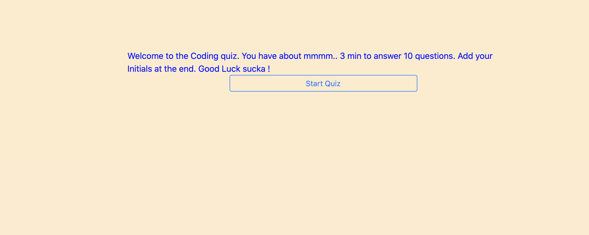
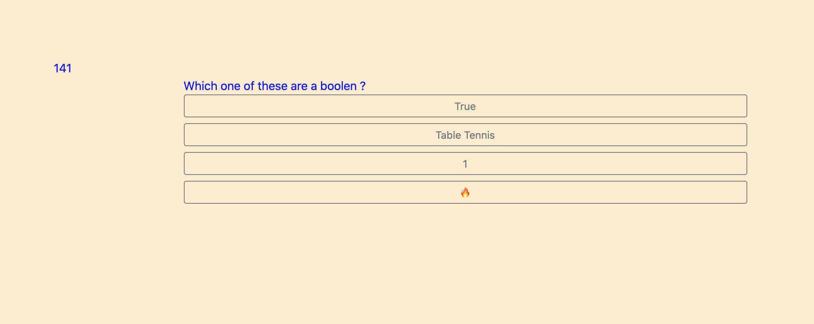
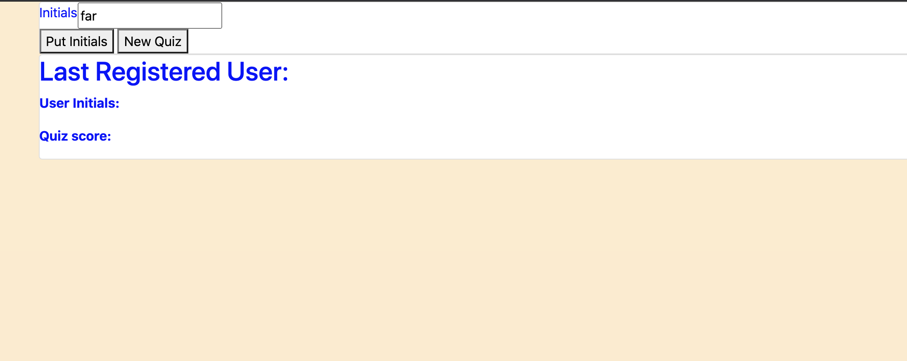
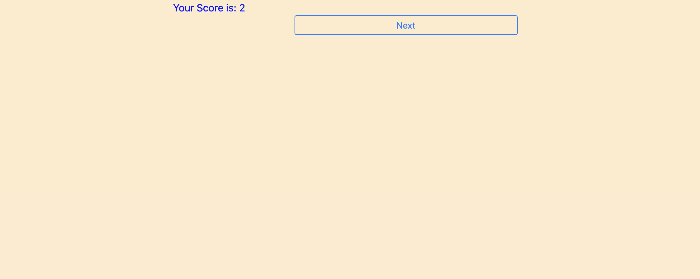

# Quiz-Game

Created the start page and a style display to hid the rest and repear when needed (inherit and none)

Created the questions with bootstrap and created the click logic 

Created the initials pg so that matched the html and then text contented it if user inputed it 

Made a logic that kept track of right or wrong answers and reduced times for the wrong answer

